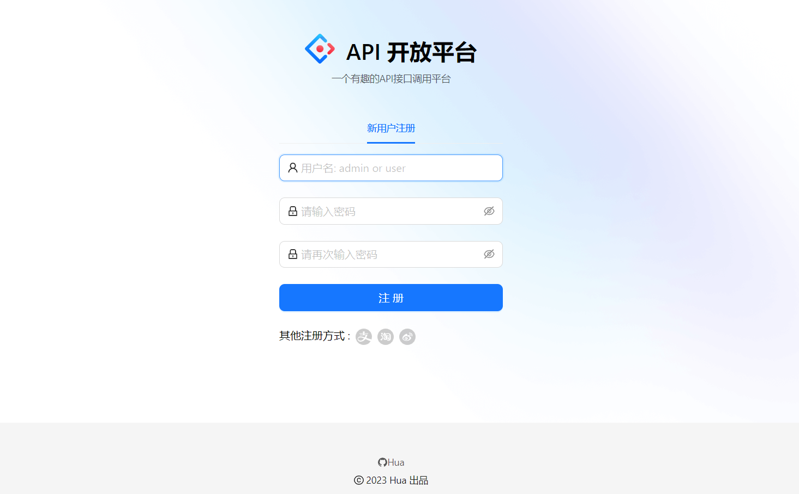
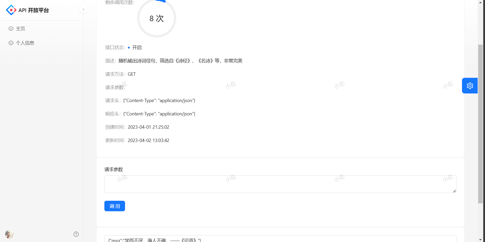
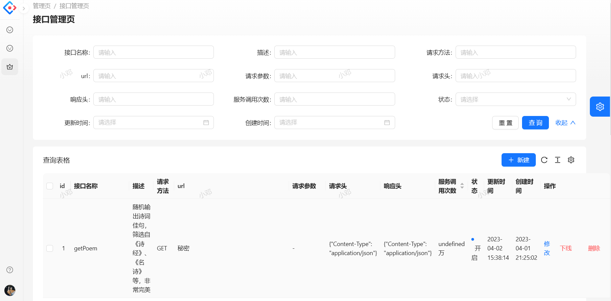

# Huaapi平台
# 项目描述
基于React + Spring Boot + Dubbo + Gateway的API接口开放调用平台。管理员可以接入并发布接口，可视化各接口调用情况；用户可以开通接口调用权限、浏览接口及在线调试，并通过客户端SDK 轻松调用接口。

# 项目展示
## 注册登录
登录

注册

## 普通用户（user）
1. 可以调用平台上各种API、查看自己的总调用次数和剩余次数，比如随机获取土味情话、随机返回抖音美女视频。
2. 可以查看个人信息，并退出登录。
## 整体界面

### 调用API示例

### 个人信息

3. 鼠标移动至左下方头像处，可显示退出登录按钮。
## 管理员（admin）
1. 拥有普通用户（user）的所有功能。
2. 管理API接口（修改、上线、下线），并支持多条件功能。

3. 接口使用分析


# 上线项目
1. 用阿里云服务器
2. nacos云服务器部署
   a. 将nacos包上传置服务器并运行
   b. 需要java和maven环境
```
运行
sh startup.sh -m standalone 单机部署

关闭
sh shutdown.sh
```
## 安装java环境
1. 安装教程：https://blog.csdn.net/qq_43329216/article/details/118385502
## 安装maven
1.安装教程：https://blog.csdn.net/zh_chong/article/details/107744424

## 部署后端Huaapi-backend
1. 先部署服务器的数据库导入sql语句
2. 开放服务器3306端口，数据库权限运行所有ip访问
3. 修改dubbo配置host地址为服务器==内网==地址，向nacos注册服务
```yml
配置为
dubbo:
  registry:
    address: nacos://服务区内网地址:8848
外网地址不能会导致服务不能注册
```
4. 修改cookie的作用域
```yml
server:
  address: 0.0.0.0
  port: 9092
  servlet:
    context-path: /api
    # cookie 30 天过期
    session:
      cookie:
        max-age: 2592000
        domain: 服务器外网IP
```
5. 修改SDK中的网关IP为服务器地址
5. 启动端口
```
java -jar Huaapi-backend-0.0.1-SNAPSHOT.jar 
```

## 打包前端项目Huaapi-frontend
1. 修改requestConfig.ts文件中的配置
```ts
  baseURL: 'http://后端公网ip地址:9092',
```
2. 修改openApi中的地址生成新的service文件（应该不需要这步）
3. config/config.ts中添加
```ts
  exportStatic: {},
```
4. 打包 build
## 使用宝塔PHP项目部署前端
1. 建立PHP项目
2. 删除PHP项目的文件夹
3. 导入我们打包好的dist文件夹
4. 设置nginx配置（一定要配置，否着前端不能正常访问到后端）
```
      location / {
        # 用于配合 browserHistory使用
        try_files $uri $uri/index.html /index.html;
  }
    
        location /api {
            rewrite ^/api/(.*) /$1 break;
            # 后台服务地址
            proxy_pass http://后端ip地址/api;
            proxy_set_header   X-Forwarded-Proto $scheme;
            proxy_set_header   Host              $http_host;
            proxy_set_header   X-Real-IP         $remote_addr;
        }
```
5. 重新启动项目


## 打包Huaapi-gateway项目
1. 修改配置中IP地址为服务器地址，和dubbo中的nacos地址
```yml
dubbo:
  application:
    name: dubbo-springboot-demo-provider
  protocol:
    name: dubbo
    port: -1
  registry:
    id: nacos-registry
    address: nacos://服务内网地址:8848
```
2. 修改模拟接口地址为服务器地址
```
    private static final String INTERFACE_HOST = "http://服务器地址外网:8123";
```
3. 打包
4. 放开服务器端口
5. 安照上线后端接口流程上线
```
java -jar Huaapi-gateway-0.0.1-SNAPSHOT.jar
```
## 打包Huaapi-interface项目
1. 修改配置IP地址
2. 如果模拟接口有连接数据库也需要把数据库放在服务器上
3. 开发端口
4. 安照上线后端接口流程上线
```
java -jar Huaapi-interface-0.0.1-SNAPSHOT.jar
```


## linux Screen保持程序后台运行
https://blog.csdn.net/Pan_peter/article/details/128875714

## 结束
觉得还不错，就请Star一下啦。
